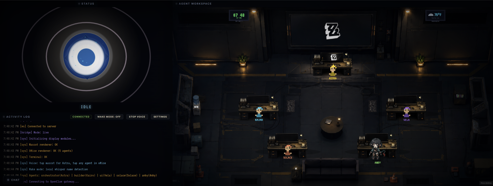

# OpenClaw Command Center

_A living, self-hosted AI ops dashboard with a pixel-art office, voice I/O, real-time agent monitoring, and Raspberry Pi kiosk support._



A self-hosted AI command center that turns your agent stack into a living pixel-art office you can actually operate. It’s built for people running OpenClaw at home, on a server, or on a Raspberry Pi kiosk who want one place to watch, talk to, and steer their agents in real time. Unlike a plain chat UI, Command Center makes AI ops feel alive—with voice, motion, and ambient system awareness—without giving up practical control.

OpenClaw is the agent runtime this project plugs into: it handles sessions, tools, routing, and gateway events while Command Center gives that activity a live visual/voice interface you can run and monitor. In short, OpenClaw is the engine, Command Center is the cockpit—grab OpenClaw here: [OPENCLAW_REPO_OR_DOCS_LINK].

## Screenshots / Demo


## Theme / Inspiration

The current default theme, agent names, and companion visuals are inspired by **Zenless Zone Zero** (the HoYoverse gacha game), because yes, operations should look cool. It’s purely cosmetic though—the system works with any OpenClaw agent names and any Codex pet companions you want to run.

## Quick Start

```bash
git clone https://github.com/EpicIsTheOne/CommandCenter.git
cd CommandCenter
npm install
cp .env.example .env
npm start
# Open http://localhost:3000
```

With zero config, the app runs in **demo mode** with simulated agent activity.

> Need the full install/config flow, troubleshooting, and live-mode details?
> See **[SETUP.md](./SETUP.md)** for the complete setup guide.

For **live OpenClaw integration**:
- set `DEMO_MODE=false`
- point `GATEWAY_URL` at your OpenClaw gateway
- either set `GATEWAY_TOKEN` manually **or** let CommandCenter auto-detect it from `~/.openclaw/openclaw.json` when running on the same machine

Open **Settings** after boot and check the **Setup Status** section. It should clearly tell you whether you are:
- in demo mode on purpose
- live and connected
- or stuck in demo fallback because gateway auth/connection failed

## What You'll See

The UI has three main zones:

- **Status / Mascot** — animated mascot canvas that reacts to listening, thinking, working, talking, and error states.
- **Office** — pixel-art office showing agents at desks, wandering around, gathering at the center table, using companion visuals, and reacting to tasks.
- **Activity Log** — terminal-style log for agent activity, tool calls, outside-session responses, voice events, and system status.

Additional panels and modals provide:

- settings for voice providers and per-agent voices
- companion/pet import and assignment
- wake-word configuration
- direct chat with reusable file/link context
- API/docs access under `/docs`

## Current Feature Set

### Live OpenClaw activity

- WebSocket bridge to the OpenClaw gateway.
- Demo fallback if the gateway is unavailable.
- Normalized agent states:
  - idle
  - listening
  - thinking
  - tool use / working
  - responding / talking
  - error
- Session monitor that watches OpenClaw session files and mirrors outside activity into Command Center.
- External replies now show in the Activity Log and get spoken by Command Center, even when the conversation started outside the Command Center UI.
- Duplicate response suppression so mirrored events do not spam the log or double-speak.

### Voice input and speech output

- Tap the mascot to talk to the primary agent.
- Tap an office agent to talk directly to that agent.
- Local/server STT route via `/api/voice/transcribe`.
- TTS playback via `/api/voice/speak`.
- Stop Voice button to interrupt playback.
- Per-agent voice assignment.
- Voice provider settings:
  - ElevenLabs
  - Fish Audio through the AIChat tagged API
- Fish Audio voice search and preview support.
- Optional asterisk/narration handling for Fish Audio output.

### Wake mode

- Wake Mode button in the Activity Log header.
- Local wake/name detection flow.
- Picovoice/Porcupine runtime support through bundled browser vendor scripts.
- Built-in Porcupine wake words.
- Uploadable custom `.ppn` wake-word files per agent.
- Wake aliases for common agent names.
- Inline wake requests: if the wake phrase includes a request after the name, Command Center can send it directly.

### Direct chat

- Direct text chat with agents without using voice.
- Persistent per-agent chat history stored under `data/chat-library/history.json`.
- Reusable file/link library stored under `data/chat-library/`.
- Upload files for later reference.
- Save URL/link references with notes.
- Attach saved files/links to direct chat requests.
- Direct chat responses broadcast back into the office/activity system.

### Companion visuals and Codex pet imports

- Per-agent visual mode:
  - default Command Center pixel agent
  - companion-style animated character
  - imported Codex pet
- Companion settings UI.
- Import Codex pets from:
  - extracted folder path containing `pet.json` and spritesheet assets
  - uploaded folder from your device
  - uploaded `.zip` package
- Codex `pet.json` animation map inference.
- Codex spritesheet rendering using stable row selection.
- Fixed Codex pet running animation flicker by locking walking/running render state while moving.
- Codex pet ambient idle animations:
  - waiting
  - review
  - waving
  - jumping
  - failed
- Direction-aware movement rows for imported pets:
  - running right
  - running left
  - walk up
  - walk down
- Safe animation fallbacks when a pet is missing a specific row/frame count.

### Office simulation

- Pixel-art office with desks, server rack, coffee machine, bookshelf, sofa, water cooler, and center table.
- Mood-driven agent behavior:
  - focused
  - restless
  - curious
  - social
  - tired
  - chaotic
- Weighted random wandering instead of obvious fixed loops.
- Recent-action penalties so agents avoid repeating the same destination too often.
- Idle micro-actions:
  - brief thoughts
  - tiny position shifts
  - facing changes
  - looking up
  - short pauses
- Time-aware behavior:
  - more coffee behavior in the morning
  - more sofa breaks during afternoon/tired moods
  - calmer late-night behavior
- Rarer center-table huddles.
- Randomized huddle topics and lines, including shipping, bugs, design, ops, ideas, users, lore, planning, code, and vibes.
- Huddles now trigger less often and feel less synchronized.
- State bubbles and thought bubbles for task states and ambient actions.
- Transient tool bubbles with badges like `WEB`, `RD`, `WR`, `CMD`, `FND`, `MEM`, `IMG`, and `CLK`.

### System and ambient widgets

- Real system health display:
  - CPU
  - memory
  - disk
  - temperature where available
- Weather widget powered by wttr.in.
- Rain ambience when weather codes indicate rain.
- Kanban-style whiteboard for agent/task state.
- Digital clock using normal 12-hour time with AM/PM.
- Hourly chime.
- Ambient keyboard clicks while agents are working.
- Task completion ding.
- Night overlay after hours.
- Adjustable vignette:
  - overall strength
  - top intensity
  - side intensity
  - bottom intensity

### API and docs

- Static API docs are served from `/docs` when deployed with the bundled docs files.
- OpenAPI document at `public/docs/openapi.json`.
- Auth-protected `/api/v1` routes.
- API support for:
  - agents
  - agent search
  - file upload/link library
  - voice settings
  - sessions
  - chat messages
  - streaming chat messages

## The Team

The default/example roster may include agents like:

| Agent | ID | Role | Color | Notes |
|-------|----|------|-------|-------|
| Main / Jansky / Astra-style primary | `main` or configured primary | Boss/orchestrator | Gold | Primary voice/masthead agent |
| Orbit | `claw-1` | Coding/tasks | Cyan | Example sub-agent |
| Nova | `claw-2` | Research/web | Purple | Example sub-agent |

The actual roster is loaded from the project/OpenClaw agent configuration, so your local names may differ.

## Architecture

### Server (`server/`)

| File | Purpose |
|------|---------|
| `index.js` | Express server, HTTP/HTTPS boot, WebSocket server, REST APIs, voice routes, direct chat, settings, docs routing, live call routes |
| `openclaw-bridge.js` | OpenClaw gateway RPC v3 WebSocket bridge, event normalization, demo fallback |
| `session-monitor.js` | Watches OpenClaw session JSONL files so outside-session work appears in Command Center |
| `voice.js` | TTS/STT integrations, ElevenLabs/Fish Audio support, voice resolution |
| `settings.js` | Voice/settings persistence and masking helpers |
| `companions.js` | Companion registry, Codex pet import, animation-map normalization |
| `agents.js` | Agent roster loading and search helpers |
| `api-auth.js` | Auth middleware for `/api/v1` |
| `api-chat-runner.js` | API chat turn runner using OpenClaw CLI |
| `api-session-store.js` | API chat/session persistence |
| `wake-settings.js` | Wake-word settings persistence |
| `wake-transcriber.js` | Wake audio transcription wrapper |
| `wake-keyword-detector.js` | Wake keyword detector wrapper |
| `gemini-live.js` / `gemini-config.js` | Gemini Live call/session integration |
| `live-tasks.js` | Background/live task helper logic |
| `call-session-store.js` | Live call session state |
| `config.js` | Environment/config loader |

### Client (`public/`)

| File | Purpose |
|------|---------|
| `js/app.js` | Browser boot, WebSocket client, event routing, settings UI, Fish playback mode controls, voice/wake/direct-chat glue |
| `js/office.js` | Canvas office renderer: agents, furniture, wandering, huddles, Codex pets, health/weather widgets, bubbles, sounds |
| `js/companions.js` | Companion preview/render helper logic for settings UI |
| `js/direct-chat.js` | Direct chat UI, file/link library UI, chat event handling |
| `js/voice.js` | Client recording/playback, TTS playback, audio controls, playback mode reporting |
| `js/wake.js` | Wake mode browser-side recording/detection flow |
| `js/mascot.js` | Mascot canvas animation and emotion states |
| `js/terminal.js` | Activity Log renderer |
| `css/styles.css` | Layout, settings modals, responsive/kiosk styling, vignette variables |
| `docs/` | Static docs and OpenAPI assets |
| `vendor/picovoice/` | Browser Picovoice/Porcupine vendor scripts |

### Data flow

Voice from Command Center:

```text
Browser tap/record → POST /api/voice/transcribe → STT → openclaw agent CLI
  → WebSocket agent events → Activity Log + Office animation + TTS playback
```

Direct chat:

```text
Direct chat UI → POST /api/chat/direct → openclaw agent CLI
  → saved chat history → WebSocket response → Activity Log + Office + optional TTS
```

Outside OpenClaw activity:

```text
OpenClaw session JSONL changes → session-monitor.js
  → normalized agent events → WebSocket → Activity Log + Office + speech
```

Companion import:

```text
Codex pet folder/zip → server/companions.js → registry/settings
  → office renderer loads spritesheet → stable animation rows/frames
```

## Environment Variables

See `.env.example` for the full template.

| Variable | Default | Description |
|----------|---------|-------------|
| `PORT` | `3000` | Server port |
| `DEMO_MODE` | `true` | `true` = no gateway needed; `false` = connect to OpenClaw gateway |
| `GATEWAY_URL` | `ws://127.0.0.1:18789` | OpenClaw gateway WebSocket URL |
| `GATEWAY_TOKEN` | — | Gateway auth token, required when `DEMO_MODE=false` |
| `OPENAI_API_KEY` | — | Enables OpenAI-backed STT/TTS paths if configured |
| `WEATHER_LOCATION` | `Kingston,Ontario,Canada` | City/region/country for wttr.in weather |
| `BASE_PATH` | — | Optional mount path, e.g. `/commandcenter` |
| `OPENCLAW_BIN` | `openclaw` | Override path/name for the OpenClaw CLI |

Additional voice/wake credentials are usually configured through the settings UI and stored in the app settings files rather than manually editing `.env`.

## Agent Configuration

### Agent config file

Copy the example to your OpenClaw config directory if you want the bundled example roster/config:

```bash
cp config/openclaw.json.example ~/.openclaw/openclaw.json
```

### System prompts

| Agent | Prompt location |
|-------|----------------|
| Primary/main | `agents/main/SYSTEM.md` → copy/use as appropriate for your OpenClaw setup |
| Orbit/example sub-agent | `agents/claw-1/SYSTEM.md` |
| Nova/example sub-agent | `agents/claw-2/SYSTEM.md` |

Sub-agent prompts are intentionally short and speed-focused.

### Agent self-setup

If your OpenClaw agent can read files, point it at `SETUP.md`. It contains step-by-step setup instructions the agent can follow.

## Companion / Codex Pet Notes

Codex imports expect a package containing a `pet.json` and a spritesheet asset. `spritesheet.webp` is the default, but the importer now also respects the path declared in `spritesheetPath`.

The renderer looks for common animation keys such as:

- `idle`
- `waiting`
- `review`
- `waving` / `wave`
- `jumping` / `jump`
- `failed` / `error`
- `runningRight` / `running-right`
- `runningLeft` / `running-left`
- `walkRight`
- `walkLeft`
- `walkUp`
- `walkDown`

If a key is missing, Command Center falls back to the closest available row so pets do not break.

## Session Architecture & Cross-Channel Awareness

The Command Center has its own UI/session path, but it can now reflect work happening outside the UI through `session-monitor.js`.

This means:

- **Command Center voice/direct chat** still has its own immediate UI flow.
- **Outside conversations/work** can appear in the Activity Log when OpenClaw session files update.
- **Final assistant responses** from outside work can be spoken in Command Center.
- **Long-term memory** remains shared by the underlying OpenClaw setup.

The result: the office feels like a live status board for the agent system, not just a separate toy panel. Shocking. Useful, even.

## Cost Optimization

Running multiple AI agents can get expensive. Suggested practices:

### 1. Use cheaper models for simple sub-agents

For sub-agents that only need to execute simple tasks, use a fast/cheap model and reserve stronger models for the primary orchestrator.

### 2. Keep sub-agent prompts short

Short prompts, short replies, and low/no reasoning for helper agents reduce cost and latency.

### 3. Reset long sessions when needed

Reset or compact long-running sessions before switching task domains or after very large conversations.

### 4. Use the Activity Log as status, not transcript storage

The Activity Log is for live visibility. Long-term continuity should live in memory/session files.

## Raspberry Pi / Kiosk Deployment

### Deploy from local machine

```bash
rsync -avz ./ pi@<PI_IP>:/home/pi/CommandCenter/ \
  --exclude node_modules --exclude .env --exclude .git --exclude data
ssh pi@<PI_IP> 'cd /home/pi/CommandCenter && npm install'
```

### Generate HTTPS certs if needed

```bash
cd /home/pi/CommandCenter
openssl req -x509 -newkey rsa:2048 \
  -keyout server/key.pem \
  -out server/cert.pem \
  -days 365 -nodes \
  -subj '/CN=localhost'
```

### Start / restart

```bash
cd /home/pi/CommandCenter
npm start
```

Or use `start.sh` for kiosk-style launches where applicable.

### Audio notes

Browser playback is handled through Web Audio / normal browser audio output. On kiosk hardware, make sure the OS output device and volume are set before launching Chromium.

## Troubleshooting

### Server won't start — port in use

```bash
fuser -k 3000/tcp
npm start
```

### Gateway connection keeps dropping

Check:

- `DEMO_MODE=false`
- `GATEWAY_URL`
- `GATEWAY_TOKEN`
- gateway reachable from this machine
- RPC v3 handshake support in `server/openclaw-bridge.js`

### Outside responses do not show or speak

Restart Command Center after pulling updates. The outside-response fix lives in server-side `session-monitor.js`, so frontend refresh alone is not enough.

### Voice not working

- Check browser mic permissions.
- Check server logs for voice route errors.
- Configure provider settings in the Settings modal.
- For ElevenLabs, verify API key and voice ID.
- For Fish Audio, verify the AIChat base URL, session cookie, format, and voice/reference ID.

### Wake mode not detecting

- Verify mic permissions.
- Check wake settings.
- For custom wake words, confirm `.ppn` files were uploaded and assigned to the correct agent.
- Try a built-in Porcupine wake word to isolate custom keyword issues.

### Codex pet import fails

- Confirm the package includes `pet.json`.
- Confirm the spritesheet path referenced by the pet metadata exists.
- Try importing from an extracted folder first, then zip once confirmed.

### Codex pet running animation flickers

This build includes the stable walking-row fix. If flicker returns:

- hard refresh the browser
- confirm `app.js` and `office.js` cache-busted versions are current
- inspect the pet's running/walking rows and `frameCounts`

### Weather widget shows wrong location

Set `WEATHER_LOCATION` in `.env` to your city, for example:

```env
WEATHER_LOCATION=Washington,DC,USA
```

## Repository

Current project repo:

```text
https://github.com/EpicIsTheOne/CommandCenter
```
n

Set `WEATHER_LOCATION` in `.env` to your city, for example:

```env
WEATHER_LOCATION=Washington,DC,USA
```

## Repository

Current project repo:

```text
https://github.com/EpicIsTheOne/CommandCenter
```


## LICENSE

[LICENSE_TYPE], see LICENSE file for details.
